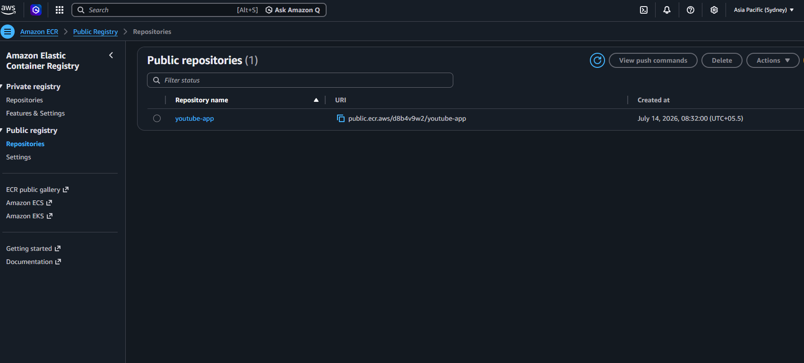
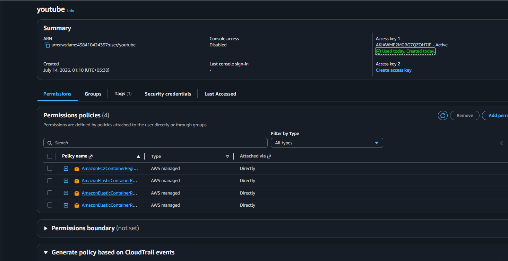
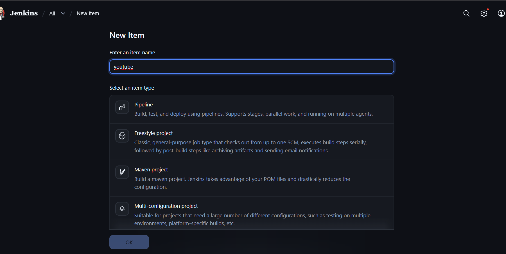
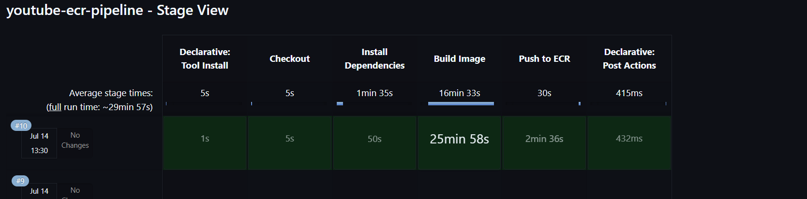

# Build and Deploy a Modern YouTube Clone Application in React JS with Material UI 5


> **DevOps-focused project** demonstrating a complete CI/CD pipeline using **Jenkins, Docker, AWS CLI, and Amazon ECR**. The application (React) is only used as the workload; the main objective is automating build and container deployment.

---

# 📌 Project Architecture

```text
GitHub Repository
        │
        ▼
 Jenkins Pipeline
        │
 ┌──────┴────────┐
 │               │
 ▼               ▼
Install      Docker Build
Dependencies      │
                  ▼
         Authenticate to AWS ECR
                  │
                  ▼
          Push Docker Image
```

---

# 🛠 Technologies

- Jenkins
- Docker
- AWS CLI
- Amazon ECR
- Git & GitHub
- NodeJS
- npm

---

# 🔌 Required Jenkins Plugins

| Plugin | Purpose |
|---------|---------|
| Docker | Docker integration |
| Docker Pipeline | Build Docker images |
| Amazon ECR | Authenticate with ECR |
| AWS Credentials | Store AWS keys |
| Pipeline | Declarative pipeline |
| Git | Checkout source |
| GitHub | GitHub integration |
| Credentials Binding | Secure secrets |
| NodeJS | Node runtime |
| Eclipse Temurin Installer | JDK installation |

---

# ⚙️ Install AWS CLI (Ubuntu)

```bash
sudo apt update
sudo apt install unzip -y
curl "https://awscli.amazonaws.com/awscli-exe-linux-x86_64.zip" -o awscliv2.zip
unzip awscliv2.zip
sudo ./aws/install
aws --version
```

## Configure AWS CLI

```bash
aws configure
```

Verify:

```bash
aws configure list
aws sts get-caller-identity
```

---

# ☁️ Create ECR Repository

```bash
aws ecr create-repository \
--repository-name yt-ecr \
--region ap-south-1
```

Verify:

```bash
aws ecr describe-repositories
```

### Screenshot




---

# 🔐 IAM User

Create an IAM user with programmatic access and attach the required Amazon ECR permissions.


 

---

# 🧰 Jenkins Setup

## Create Pipeline Job

- New Item
- Enter project name
- Select **Pipeline**
- Click **OK**



---

## Configure Tools

Configure:

- node16
- jdk17


## Configure Credentials

Create AWS Credentials with ID:
## AWS ECR Repository


```text
youtube
```

Pipeline uses:

```text
ecr:ap-south-1:youtube
```

## Create Pipeline Job


---

# 📄 Jenkins Pipeline (pipeline.txt)

Paste your complete `pipeline.txt` here so recruiters can see the actual pipeline.

```groovy
pipeline {
    agent any

    environment {
        AWS_ACCOUNT_ID     = "438410424397"
        AWS_DEFAULT_REGION = "ap-south-1"
        IMAGE_REPO_NAME    = "yt-ecr"
        IMAGE_TAG          = "latest"
        REPOSITORY_URI     = "${AWS_ACCOUNT_ID}.dkr.ecr.${AWS_DEFAULT_REGION}.amazonaws.com/${IMAGE_REPO_NAME}"
    }

    tools {
        nodejs 'node16'
        jdk 'jdk17'
    }

    stages {

        stage('Checkout') {
            steps {
                git branch: 'main', url: 'https://github.com/sahilhinge89/youtube.git'
            }
        }

        stage('Install Dependencies') {
            steps {
                sh "npm install"
            }
        }

        stage('Build Image') {
            steps {
                script {
                    dockerImage = docker.build("${IMAGE_REPO_NAME}:${IMAGE_TAG}")
                }
            }
        }

        stage('Push to ECR') {
            steps {
                script {
                    withDockerRegistry(credentialsId: 'ecr:ap-south-1:youtube', url: "https://${REPOSITORY_URI}") {
                        sh "docker tag ${IMAGE_REPO_NAME}:${IMAGE_TAG} ${REPOSITORY_URI}:${IMAGE_TAG}"
                        sh "docker push ${REPOSITORY_URI}:${IMAGE_TAG}"
                    }
                }
            }
        }
    }

    post {
        success {
            echo "Pipeline completed successfully. Image pushed to: ${REPOSITORY_URI}:${IMAGE_TAG}"
        }
        failure {
            echo "Pipeline failed. Check console output above for the failing stage."
        }
    }
}
```

---

# 🚀 Pipeline Stages

1. Checkout Source Code
2. Install Dependencies
3. Build Docker Image
4. Push Docker Image to AWS ECR

---

# ✅ Successful Pipeline




---

# 🐳 Docker Commands

```bash
docker build -t yt-ecr .
docker images
docker tag yt-ecr:latest <ACCOUNT_ID>.dkr.ecr.ap-south-1.amazonaws.com/yt-ecr:latest
docker push <ACCOUNT_ID>.dkr.ecr.ap-south-1.amazonaws.com/yt-ecr:latest
```

---

# 📋 Useful AWS CLI Commands

```bash
aws configure list
aws sts get-caller-identity
aws ecr describe-repositories
aws ecr list-images --repository-name yt-ecr
aws ecr describe-images --repository-name yt-ecr
aws ecr delete-repository --repository-name yt-ecr --force
```

---

# 📌 Troubleshooting

## Docker Permission

```bash
sudo usermod -aG docker jenkins
sudo systemctl restart jenkins
```

## Verify AWS

```bash
aws sts get-caller-identity
```

## Verify Region

```bash
aws configure get region
```

## Login to ECR

```bash
aws ecr get-login-password --region ap-south-1 | docker login --username AWS --password-stdin <ACCOUNT_ID>.dkr.ecr.ap-south-1.amazonaws.com
```

---

**Author:** Sahil Hinge

